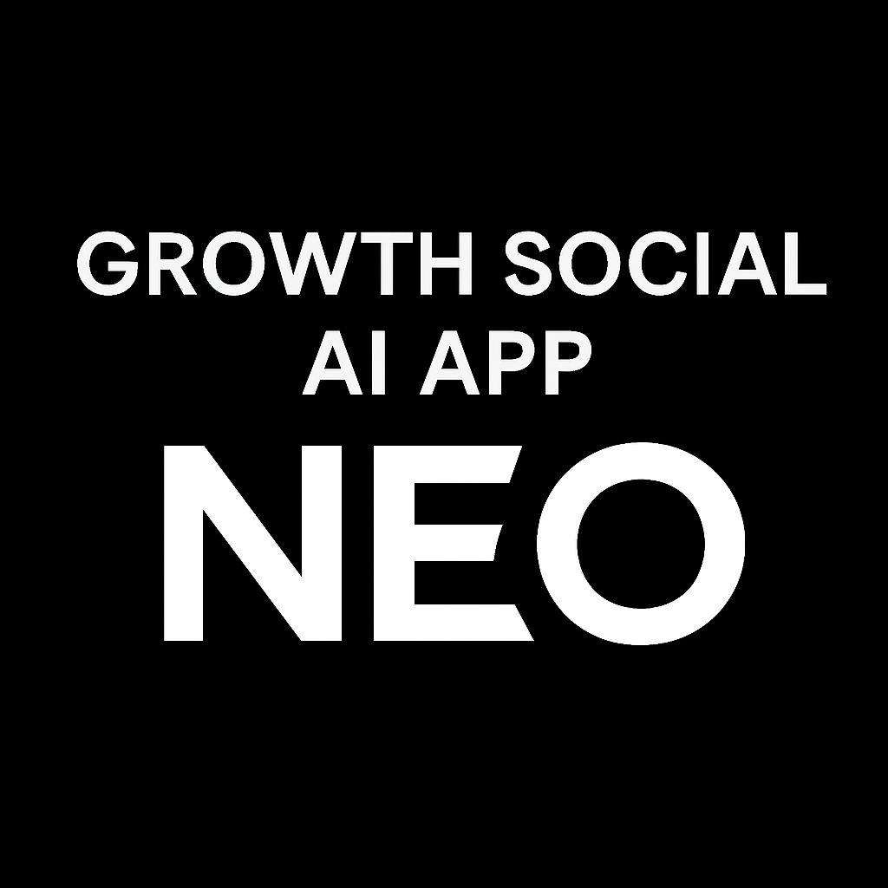

# Growth Social AI App

<div align="center">
  
  
  <h3>Your Personal AI-Powered Growth and Social Platform</h3>

<a href="https://github.com/neothan-dev/growth-social-ai-app/blob/main/README.md"></a>
<a href="https://github.com/neothan-dev/growth-social-ai-app/blob/main/doc/README-CN.md"></a>
<a href="https://github.com/neothan-dev/growth-social-ai-app/blob/main/doc/README-JP.md"></a>
<a href="https://github.com/neothan-dev/growth-social-ai-app/blob/main/doc/README-KR.md"></a>
<a href="https://github.com/neothan-dev/growth-social-ai-app/blob/main/doc/README-ES.md"></a>
<a href="https://github.com/neothan-dev/growth-social-ai-app/blob/main/doc/README-FR.md"></a>
<a href="https://github.com/neothan-dev/growth-social-ai-app/blob/main/doc/README-IT.md"></a>
  
  [](https://flutter.dev/)
  [](https://dart.dev/)
  [](https://opensource.org/licenses/Apache-2.0)
  [](https://flutter.dev/)
</div>

## 🌟 Overview

Growth Social AI App is a comprehensive Flutter-based cross-platform application that serves as your intelligent growth and social companion. It combines personal growth tracking, data analysis, social community features, friend chat, and AI voice conversation capabilities into a single, powerful platform.

## ✨ Key Features

### 🏥 Health & Wellness
- **Personal Growth Tracking**: Record and monitor your daily health metrics
- **Health Data Analysis**: Comprehensive analytics and insights into your wellness journey
- **Progress Visualization**: Beautiful charts and graphs to track your improvement over time
- **Health Goals**: Set and achieve personalized health objectives

### 🤖 AI-Powered Features
- **AI Voice Chat**: Natural language conversations with your AI health assistant
- **Intelligent Recommendations**: Personalized health advice based on your data
- **Voice Style Customization**: Multiple AI voice personalities to choose from
- **Real-time Health Coaching**: Get instant feedback and guidance

### 👥 Social & Community
- **Social Hub**: Connect with like-minded individuals on their health journey
- **Community Sharing**: Share your progress and achievements
- **Friend System**: Add friends and track their progress together
- **Moment Sharing**: Post updates about your health journey
- **Expert Articles**: Access curated health and wellness content

### 💬 Communication
- **Real-time Chat**: Instant messaging with friends and community members
- **Voice Messages**: Send and receive voice notes
- **Group Conversations**: Participate in health-focused group discussions
- **Notification System**: Stay updated with important health reminders

### 🌍 Internationalization
- **Multi-language Support**: Available in multiple languages
- **Localized Content**: Region-specific health information and recommendations
- **Cultural Adaptation**: Health advice tailored to different cultural contexts

## 🚀 Getting Started

### Prerequisites

- Flutter SDK (3.10.0 or higher)
- Dart SDK
- Android Studio / Xcode (for mobile development)
- VS Code (recommended IDE)

### Installation

1. **Clone the repository**
   ```bash
   git clone https://github.com/neothan-dev/growth-social-ai-app.git
   cd growth-social-ai-app
   ```

2. **Install dependencies**
   ```bash
   flutter pub get
   ```

3. **Run the application**
   ```bash
   flutter run
   ```

### Platform-Specific Setup

#### Android
```bash
flutter build apk --release
```

#### iOS
```bash
flutter build ios --release
```

#### Web
```bash
flutter build web --release
```

#### Desktop (Windows/macOS/Linux)
```bash
flutter build windows --release
flutter build macos --release
flutter build linux --release
```

## 🏗️ Architecture

### Project Structure
```
lib/
├── config/           # Configuration files
├── models/           # Data models
├── screens/          # UI screens
├── services/         # Business logic services
├── widgets/          # Reusable UI components
├── theme/            # App theming
├── utils/            # Utility functions
└── localization/     # Internationalization
```

### Key Components

- **AI Service**: Handles AI conversation and recommendations
- **Health Data Service**: Manages health metrics and analytics
- **Social Service**: Handles community and friend interactions
- **Voice Service**: Manages voice recognition and synthesis
- **Auth Service**: User authentication and management
- **Navigation Manager**: App navigation and routing

## 🛠️ Technologies Used

- **Flutter**: Cross-platform UI framework
- **Dart**: Programming language
- **SQLite**: Local database storage
- **HTTP**: Network communication
- **WebSocket**: Real-time communication
- **Lottie**: Animations
- **Provider**: State management
- **Shared Preferences**: Local storage
- **Permission Handler**: Device permissions
- **Path Provider**: File system access

## 📊 Features in Detail

### Health Tracking
- Daily health metrics recording
- Progress visualization with charts
- Goal setting and achievement tracking
- Health trend analysis
- Personalized recommendations

### AI Assistant
- Natural language processing
- Voice recognition and synthesis
- Contextual health advice
- Personalized coaching
- Multiple AI personalities

### Social Features
- User profiles and avatars
- Friend connections
- Community posts and sharing
- Group discussions
- Achievement sharing

### Data Management
- Local SQLite database
- Cloud synchronization
- Data export/import
- Privacy controls
- Backup and restore

## 🔧 Configuration

### Environment Setup
Create a `.env` file in the root directory:
```env
API_BASE_URL=your_api_url
AI_SERVICE_URL=your_ai_service_url
VOICE_SERVICE_URL=your_voice_service_url
```

### Network Configuration
Update `lib/config/network_config.dart` with your API endpoints.

### Voice Configuration
Configure voice settings in `lib/config/voice_config.dart`.

## 🤝 Contributing

We welcome contributions! Please see our [Contributing Guidelines](CONTRIBUTING.md) for details.

### Development Workflow
1. Fork the repository
2. Create a feature branch
3. Make your changes
4. Add tests if applicable
5. Submit a pull request

## 📝 License

This project is licensed under the Apache License 2.0 - see the [LICENSE](LICENSE) file for details.

## 🆘 Support

- **Documentation**: [Wiki](https://github.com/neothan-dev/growth-social-ai-app/wiki)
- **Issues**: [GitHub Issues](https://github.com/neothan-dev/growth-social-ai-app/issues)
- **Discussions**: [GitHub Discussions](https://github.com/neothan-dev/growth-social-ai-app/discussions)
- **Email**: neothan7@hotmail.com

## 🗺️ Roadmap

- [ ] Advanced AI health coaching
- [ ] Integration with wearable devices
- [ ] Telemedicine features
- [ ] Advanced analytics dashboard
- [ ] Multi-tenant support
- [ ] API for third-party integrations

## 🙏 Acknowledgments

- Flutter team for the amazing framework
- Open source community for various packages
- Health professionals for domain expertise
- Beta testers for valuable feedback

## 📈 Statistics


---

<div align="center">
  <p>Made with ❤️ by the Growth Social AI Team</p>
  <p>⭐ Star this repository if you find it helpful!</p>
</div>
