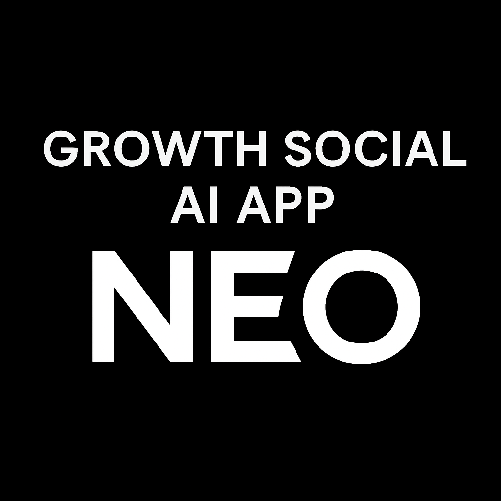

# Growth Social AI App

<div align="center">
  
  
  <h3>Votre Plateforme Personnelle de Croissance et Sociale avec IA</h3>

  <a href="https://github.com/neothan-dev/growth-social-ai-app/blob/main/README.md"></a>
<a href="https://github.com/neothan-dev/growth-social-ai-app/blob/main/doc/README-CN.md"></a>
<a href="https://github.com/neothan-dev/growth-social-ai-app/blob/main/doc/README-JP.md"></a>
<a href="https://github.com/neothan-dev/growth-social-ai-app/blob/main/doc/README-KR.md"></a>
<a href="https://github.com/neothan-dev/growth-social-ai-app/blob/main/doc/README-ES.md"></a>
<a href="https://github.com/neothan-dev/growth-social-ai-app/blob/main/doc/README-FR.md"></a>
<a href="https://github.com/neothan-dev/growth-social-ai-app/blob/main/doc/README-IT.md"></a>
  
  [](https://flutter.dev/)
  [](https://dart.dev/)
  [](https://opensource.org/licenses/Apache-2.0)
  [](https://flutter.dev/)
</div>

## 🌟 Aperçu

Growth Social AI App est une application multiplateforme complète basée sur Flutter qui sert de compagnon intelligent de croissance et social. Elle combine le suivi de croissance personnel, l'analyse de données, les fonctionnalités de communauté sociale, le chat entre amis et les capacités de conversation vocale IA en une seule plateforme puissante.

## ✨ Fonctionnalités Clés

### 🏥 Santé et Bien-être
- **Suivi de Croissance Personnel** : Enregistrez et surveillez vos métriques de santé quotidiennes
- **Analyse des Données de Santé** : Analyses complètes et insights sur votre parcours de bien-être
- **Visualisation des Progrès** : Graphiques et diagrammes magnifiques pour suivre votre amélioration au fil du temps
- **Objectifs de Santé** : Définissez et atteignez des objectifs de santé personnalisés

### 🤖 Fonctionnalités Alimentées par l'IA
- **Chat Vocal IA** : Conversations en langage naturel avec votre assistant de santé IA
- **Recommandations Intelligentes** : Conseils de santé personnalisés basés sur vos données
- **Personnalisation du Style Vocal** : Plusieurs personnalités vocales IA à choisir
- **Coaching de Santé en Temps Réel** : Obtenez des commentaires et conseils instantanés

### 👥 Social et Communauté
- **Hub Social** : Connectez-vous avec des personnes partageant les mêmes idées dans leur parcours de santé
- **Partage Communautaire** : Partagez vos progrès et réalisations
- **Système d'Amis** : Ajoutez des amis et suivez leurs progrès ensemble
- **Partage de Moments** : Publiez des mises à jour sur votre parcours de santé
- **Articles d'Experts** : Accédez à du contenu curé sur la santé et le bien-être

### 💬 Communication
- **Chat en Temps Réel** : Messagerie instantanée avec des amis et membres de la communauté
- **Messages Vocaux** : Envoyez et recevez des notes vocales
- **Conversations de Groupe** : Participez à des discussions de groupe axées sur la santé
- **Système de Notifications** : Restez informé des rappels de santé importants

### 🌍 Internationalisation
- **Support Multi-langues** : Disponible en plusieurs langues
- **Contenu Localisé** : Informations de santé spécifiques à la région et recommandations
- **Adaptation Culturelle** : Conseils de santé adaptés à différents contextes culturels

## 🚀 Commencer

### Prérequis

- Flutter SDK (3.10.0 ou supérieur)
- Dart SDK
- Android Studio / Xcode (pour le développement mobile)
- VS Code (IDE recommandé)

### Installation

1. **Cloner le dépôt**
   ```bash
   git clone https://github.com/neothan-dev/growth-social-ai-app.git
   cd growth-social-ai-app
   ```

2. **Installer les dépendances**
   ```bash
   flutter pub get
   ```

3. **Exécuter l'application**
   ```bash
   flutter run
   ```

### Configuration Spécifique à la Plateforme

#### Android
```bash
flutter build apk --release
```

#### iOS
```bash
flutter build ios --release
```

#### Web
```bash
flutter build web --release
```

#### Bureau (Windows/macOS/Linux)
```bash
flutter build windows --release
flutter build macos --release
flutter build linux --release
```

## 🏗️ Architecture

### Structure du Projet
```
lib/
├── config/           # Fichiers de configuration
├── models/           # Modèles de données
├── screens/          # Écrans d'interface utilisateur
├── services/         # Services de logique métier
├── widgets/          # Composants d'interface utilisateur réutilisables
├── theme/            # Thèmes de l'application
├── utils/            # Fonctions utilitaires
└── localization/     # Internationalisation
```

### Composants Clés

- **Service IA** : Gère les conversations et recommandations IA
- **Service de Données de Santé** : Gère les métriques de santé et analyses
- **Service Social** : Gère les interactions communautaires et amicales
- **Service Vocal** : Gère la reconnaissance et synthèse vocale
- **Service d'Authentification** : Authentification et gestion des utilisateurs
- **Gestionnaire de Navigation** : Navigation et routage de l'application

## 🛠️ Technologies Utilisées

- **Flutter** : Framework d'interface utilisateur multiplateforme
- **Dart** : Langage de programmation
- **SQLite** : Stockage de base de données locale
- **HTTP** : Communication réseau
- **WebSocket** : Communication en temps réel
- **Lottie** : Animations
- **Provider** : Gestion d'état
- **Shared Preferences** : Stockage local
- **Permission Handler** : Permissions du dispositif
- **Path Provider** : Accès au système de fichiers

## 📊 Fonctionnalités en Détail

### Suivi de Santé
- Enregistrement des métriques de santé quotidiennes
- Visualisation des progrès avec graphiques
- Définition d'objectifs et suivi des réalisations
- Analyse des tendances de santé
- Recommandations personnalisées

### Assistant IA
- Traitement du langage naturel
- Reconnaissance et synthèse vocale
- Conseils de santé contextuels
- Coaching personnalisé
- Personnalités IA multiples

### Fonctionnalités Sociales
- Profils utilisateur et avatars
- Connexions d'amis
- Publications et partage communautaire
- Discussions de groupe
- Partage de réalisations

### Gestion des Données
- Base de données SQLite locale
- Synchronisation cloud
- Export/import de données
- Contrôles de confidentialité
- Sauvegarde et restauration

## 🔧 Configuration

### Configuration de l'Environnement
Créer un fichier `.env` dans le répertoire racine :
```env
API_BASE_URL=your_api_url
AI_SERVICE_URL=your_ai_service_url
VOICE_SERVICE_URL=your_voice_service_url
```

### Configuration Réseau
Mettre à jour `lib/config/network_config.dart` avec vos points de terminaison API.

### Configuration Vocale
Configurer les paramètres vocaux dans `lib/config/voice_config.dart`.

## 🤝 Contribution

Nous accueillons les contributions ! Veuillez consulter nos [Directives de Contribution](CONTRIBUTING.md) pour plus de détails.

### Flux de Travail de Développement
1. Fork du dépôt
2. Créer une branche de fonctionnalité
3. Apporter vos modifications
4. Ajouter des tests si applicable
5. Soumettre une demande de tirage

## 📝 Licence

Ce projet est sous licence Apache License 2.0 - voir le fichier [LICENSE](LICENSE) pour plus de détails.

## 🆘 Support

- **Documentation** : [Wiki](https://github.com/neothan-dev/growth-social-ai-app/wiki)
- **Problèmes** : [GitHub Issues](https://github.com/neothan-dev/growth-social-ai-app/issues)
- **Discussions** : [GitHub Discussions](https://github.com/neothan-dev/growth-social-ai-app/discussions)
- **Email** : neothan7@hotmail.com

## 🗺️ Feuille de Route

- [ ] Coaching de santé IA avancé
- [ ] Intégration avec des dispositifs portables
- [ ] Fonctionnalités de télémédecine
- [ ] Tableau de bord d'analyse avancé
- [ ] Support multi-tenant
- [ ] API pour intégrations tierces

## 🙏 Remerciements

- Équipe Flutter pour le framework incroyable
- Communauté open source pour divers packages
- Professionnels de la santé pour l'expertise du domaine
- Testeurs bêta pour les commentaires précieux

## 📈 Statistiques


---

<div align="center">
  <p>Fait avec ❤️ par l'Équipe Growth Social AI</p>
  <p>⭐ Donnez une étoile à ce dépôt si vous le trouvez utile !</p>
</div>
